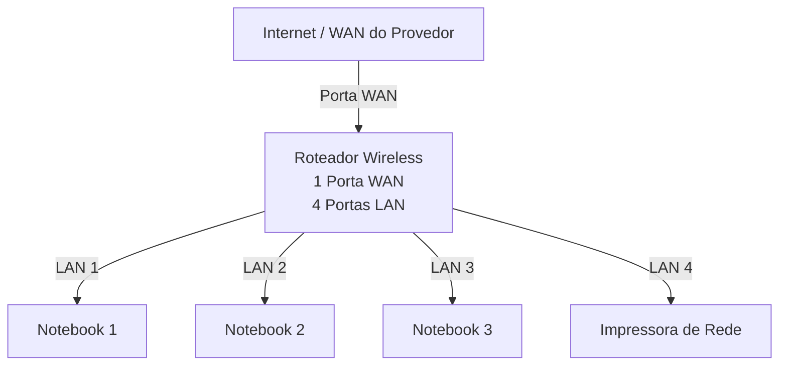
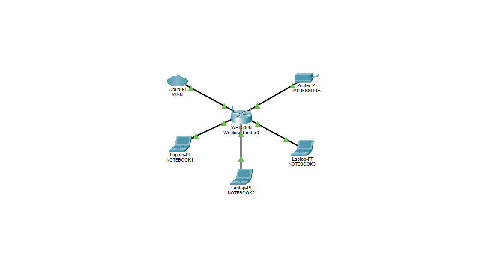

# 🖧 Laboratório de Redes 01 – Projeto de Rede Local

Projeto desenvolvido na disciplina de **Redes de Computadores** do **Curso Técnico em Informática do SENAC**, com o objetivo de aplicar na prática conceitos básicos de **redes locais (LAN)** e comunicação entre dispositivos.

**Aluna:** Giovanna Lima dos Santos  
**Professor:** José de Assis  
**Data:** 09/03/2026

---

## 1. Objetivo

Implementar uma rede local simples conectando **3 notebooks**, um **roteador wireless com switch integrado** e uma **impressora de rede**.

O projeto será realizado em duas etapas:

1. **Simulação da rede** no Cisco Packet Tracer  
2. **Implementação da rede** no laboratório real

---

## 2. Equipamentos Utilizados

- 3 notebooks  
- 1 roteador wireless (1 porta WAN e 4 portas LAN)  
- 1 impressora de rede  
- Cabos de rede

---

## 3. Topologia da Rede

Diagrama da rede lógica utilizada neste laboratório.

Imagem da topologia utilizada no laboratório

